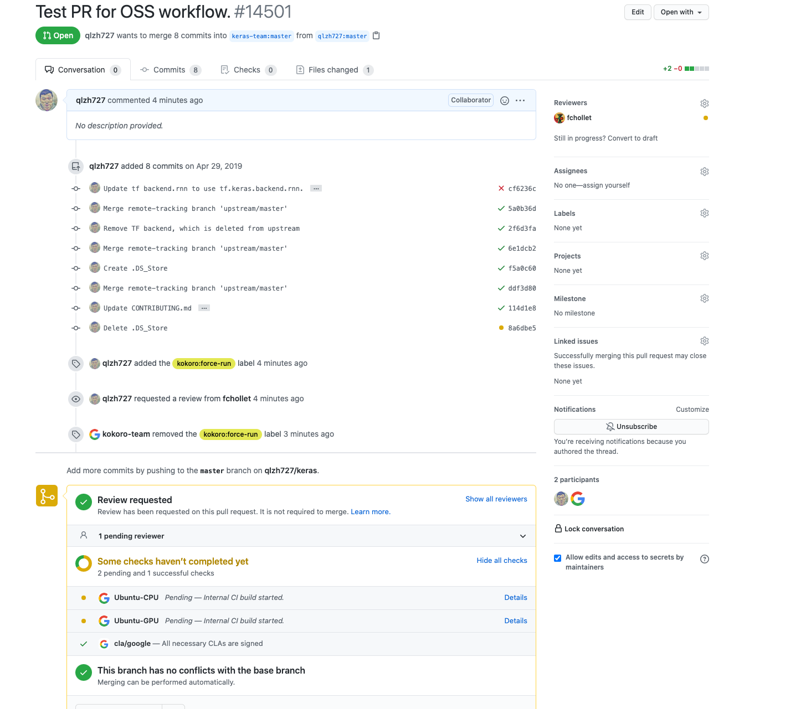

Want to contribute? Great! First, read this page
(including the "small print" section).

### Before you contribute

Before we can use your code, you must sign the
[Google Individual Contributor License Agreement](
https://cla.developers.google.com/about/google-individual)
(CLA), which you can do online. The CLA is necessary mainly because you own the
copyright to your changes, even after your contribution becomes part of our
codebase, so we need your permission to use and distribute your code. We also
need to be sure of various other things—for instance that you'll tell us if you
know that your code infringes on other people's patents. You don't have to sign
the CLA until after you've submitted your code for review and a member has
approved it, but you must do it before we can put your code into our codebase.
Before you start working on a larger contribution, you should get in touch with
us first through the issue tracker with your idea so that we can help out and
possibly guide you. Coordinating up front makes it much easier to avoid
frustration later on.

### Code reviews

All submissions, including submissions by project members, require review. We
use Github Pull Requests (PRs) for this purpose. We recommend you read [this guide](
https://docs.github.com/en/github/collaborating-with-issues-and-pull-requests/about-pull-requests)
if you haven't created a Pull Request before.

Before making any changes, we recommend opening an issue (if one doesn't already
exist) and discussing your proposed changes. This way, we can give you feedback
and validated the proposed changes. If the changes are minor (simple bug fix
of documentation fix), then feel free to open a PR without discussion.

### The small print

Contributions made by corporations are covered by a different agreement than
the one above, the
[Software Grant and Corporate Contributor License Agreement](
https://cla.developers.google.com/about/google-corporate).

### Tools needed for development

1. [Bazel](https://bazel.build/) is the tool to build and test Keras project.
   See [installtation guild](https://docs.bazel.build/versions/4.0.0/install.html)
   for how to install and config bazel for your local environment.
2. [git](https://github.com/) for code repository management.
3. [python](https://www.python.org/) for build and test Keras project.

### Setup and check local workspace

Using Apple Mac as an example (and linux will be very similar), the following
commands set up and check the configuration of a local workspace.

```shell
scottzhu-macbookpro2:~ scottzhu$ which bazel
/Users/scottzhu/bin/bazel

scottzhu-macbookpro2:~ scottzhu$ which git
/usr/local/git/current/bin/git

scottzhu-macbookpro2:~ scottzhu$ which python
/usr/bin/python

# Keras requires at least python 3.6
scottzhu-macbookpro2:~ scottzhu$ python --version
Python 3.6.8

# Change to whatever directory you prefer
scottzhu-macbookpro2:~ scottzhu$ mkdir workspace
scottzhu-macbookpro2:~ scottzhu$ cd workspace/
```

### Download keras code and setup virtual environment

A [Python virtual environment](https://docs.python.org/3/tutorial/venv.html) is a
powerful tool to create a self-contained environment that isolates any change
from the system level config. It is highly recommended to avoid any unexpected
dependency or version issue.

```shell
scottzhu-macbookpro2:workspace scottzhu$ git clone https://github.com/keras-team/keras.git
Cloning into 'keras'...
remote: Enumerating objects: 492, done.
remote: Counting objects: 100% (492/492), done.
remote: Compressing objects: 100% (126/126), done.
remote: Total 35951 (delta 381), reused 443 (delta 366), pack-reused 35459
Receiving objects: 100% (35951/35951), 15.70 MiB | 16.09 MiB/s, done.
Resolving deltas: 100% (26243/26243), done.

scottzhu-macbookpro2:workspace scottzhu$ mkdir venv_dir
scottzhu-macbookpro2:workspace scottzhu$ python3 -m venv venv_dir
scottzhu-macbookpro2:workspace scottzhu$ source venv_dir/bin/activate
(venv_dir) scottzhu-macbookpro2:workspace scottzhu$ ls
keras       venv_dir

(venv_dir) scottzhu-macbookpro2:workspace scottzhu$ cd keras

(venv_dir) scottzhu-macbookpro2:workspace scottzhu$ pip install -r requirements.txt
Collecting pandas
  Using cached pandas-1.2.3-cp38-cp38-manylinux1_x86_64.whl (9.7 MB)
Collecting pydot
...
...
...

# Since tf-nightly uses keras-nightly as a dependency, we need to uninstall
# keras-nightly so that tests will run against keras code in local workspace.
(venv_dir) scottzhu-macbookpro2:workspace scottzhu$ pip uninstall keras-nightly
Found existing installation: keras-nightly 2.5.0.dev2021032500
Uninstalling keras-nightly-2.5.0.dev2021032500:
  Successfully uninstalled keras-nightly-2.5.0.dev2021032500
```

### Run a test locally

```shell
(venv_dir) scottzhu-macbookpro2:keras scottzhu$ bazel test -c opt keras:backend_test
WARNING: The following configs were expanded more than once: [v2]. For repeatable flags, repeats are counted twice and may lead to unexpected behavior.
INFO: Options provided by the client:
  Inherited 'common' options: --isatty=1 --terminal_columns=147
INFO: Reading rc options for 'test' from /Users/scottzhu/workspace/keras/.bazelrc:
  Inherited 'build' options: --apple_platform_type=macos --define open_source_build=true --define=use_fast_cpp_protos=false --define=tensorflow_enable_mlir_generated_gpu_kernels=0 --define=allow_oversize_protos=true --spawn_strategy=standalone -c opt --announce_rc --define=grpc_no_ares=true --config=short_logs --config=v2
INFO: Reading rc options for 'test' from /Users/scottzhu/workspace/keras/.bazelrc:
  'test' options: --define open_source_build=true --define=use_fast_cpp_protos=false --config=v2
INFO: Found applicable config definition build:short_logs in file /Users/scottzhu/workspace/keras/.bazelrc: --output_filter=DONT_MATCH_ANYTHING
INFO: Found applicable config definition build:v2 in file /Users/scottzhu/workspace/keras/.bazelrc: --define=tf_api_version=2 --action_env=TF2_BEHAVIOR=1
INFO: Found applicable config definition build:v2 in file /Users/scottzhu/workspace/keras/.bazelrc: --define=tf_api_version=2 --action_env=TF2_BEHAVIOR=1
INFO: Analyzed target //keras:backend_test (0 packages loaded, 0 targets configured).
INFO: Found 1 test target...
Target //keras:backend_test up-to-date:
  bazel-bin/keras/backend_test
INFO: Elapsed time: 45.535s, Critical Path: 45.26s
INFO: 19 processes: 19 local.
INFO: Build completed successfully, 20 total actions
//keras:backend_test                                                     PASSED in 45.2s
  Stats over 4 runs: max = 45.2s, min = 40.0s, avg = 41.5s, dev = 2.1s

INFO: Build completed successfully, 20 total actions
```

### Creating PR and wait for review

Once the local change is made and verified with tests, you can open a PR in
[keras-team/keras](https://github.com/keras-team/keras). After the PR is sent,
it will go through a set of tests to verify its correctness. Once
the PR is tested and approved by the reviewer, the PR will be mirrored to
Google internal repository. The PR will be marked as merged once the merge to
Google internal repository is successfully finished. This is same as the
Tensorflow OSS contribution workflow.

See the following images as an example for a PR and its related tests.


