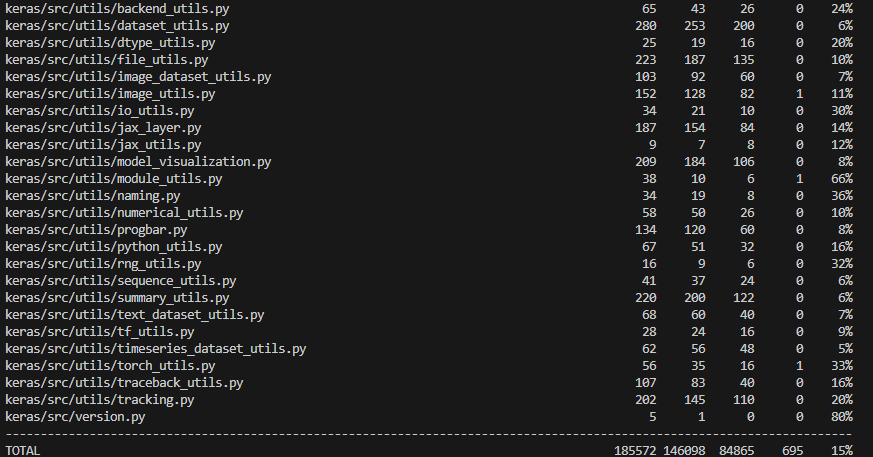
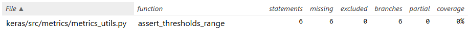
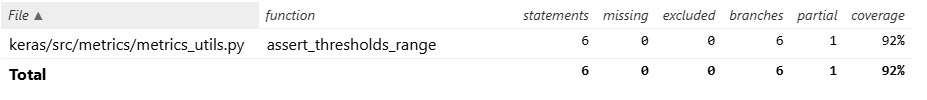
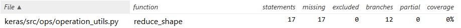
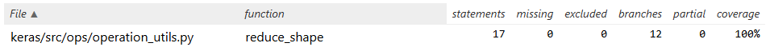

# Report for Assignment 1 resit

## Project chosen

Name: Keras

URL: https://github.com/keras-team/keras

Number of lines of code and the tool used to count it: 267262 (lizard)

Programming language: Python

## Coverage measurement with existing tool

I used Coverage.py as the existing tool to check the coverage of the forked project.
It was executed by the command `coverage run -m unittest discover `

## Coverage improvement

### Individual tests

assert_threshold_range from keras/src/metrics/metrics_utils.py
[Relevant commit](https://github.com/keras-team/keras/commit/60452d4d23c5de55b52fe0050206ccbe90ad81b7) \
Old coverage: \

New coverage: \

As can be seen in the images, the 'assert_threshold_range' function has an improved coverage of 92%. Which used to be 0% before my added testcases.

reduce_shape from keras/src/ops/operation_utils.py
[Relevant commit](https://github.com/keras-team/keras/commit/534807455d6440bbdcebbdd977efa5c1d0c8a7e7) \
Old coverage: \

New coverage: \

As can be seen in the images, the 'reduce_shape' function has an improved coverage of 100%. Which used to be 0% before my added testcases.

### Overall

Overall old coverage: \

Overall new coverage: \

